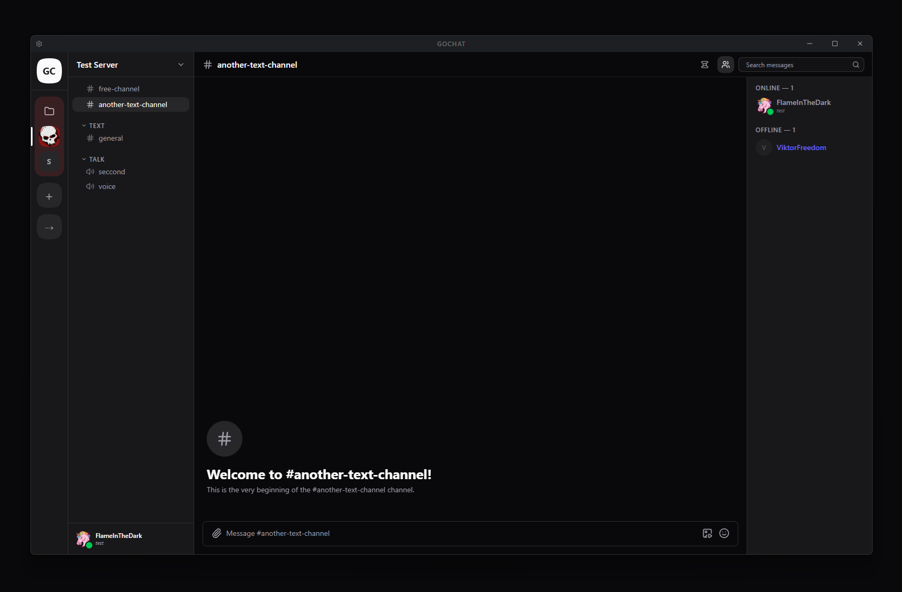

# GoChat Desktop

Electron desktop client for [GoChat](https://github.com/FlameInTheDark/gochat), built with React + Tailwind CSS.

## Screenshot



## Prerequisites

- [Node.js](https://nodejs.org/) 18+
- npm 9+
- A running GoChat backend

## Setup

```bash
npm install
```

Copy the environment file and point it at your backend:

```bash
cp .env.example .env
```

Edit `.env`:

```
VITE_API_BASE_URL=http://localhost/api/v1
VITE_WEBSOCKET_URL=ws://localhost/ws/subscribe
```

## Development

```bash
npm run start
```

Launches the Electron app with Vite hot-reload for the renderer.

## Build

```bash
npm run make
```

Produces platform installers in `out/make/`:

| Platform | Output |
|----------|--------|
| Windows  | Squirrel installer (`out/make/squirrel.windows/`) |
| macOS    | ZIP archive (`out/make/zip/darwin/`) |
| Linux    | `.deb` and `.rpm` packages |

## Lint

```bash
npm run lint
```

## Project Structure

```
src/
├── main.ts          # Electron main process (BrowserWindow, IPC)
├── preload.ts       # Exposes window.electronAPI to renderer
├── renderer.tsx     # React entry point
├── App.tsx          # Router + providers
├── components/
│   └── layout/
│       └── TitleBar.tsx   # Custom frameless window titlebar
├── pages/           # Route pages (Login, Register, App, DM, Channel…)
├── stores/          # Zustand stores (auth, messages, ui…)
├── api/             # Configured Axios + API instances
└── client/          # Auto-generated OpenAPI client (do not edit)
```

The React source lives alongside the Electron main/preload files in `src/`. The reference web-only version is in `research/gochat-react/`.
